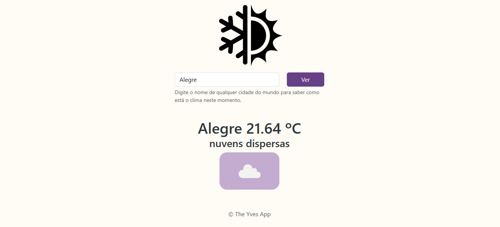
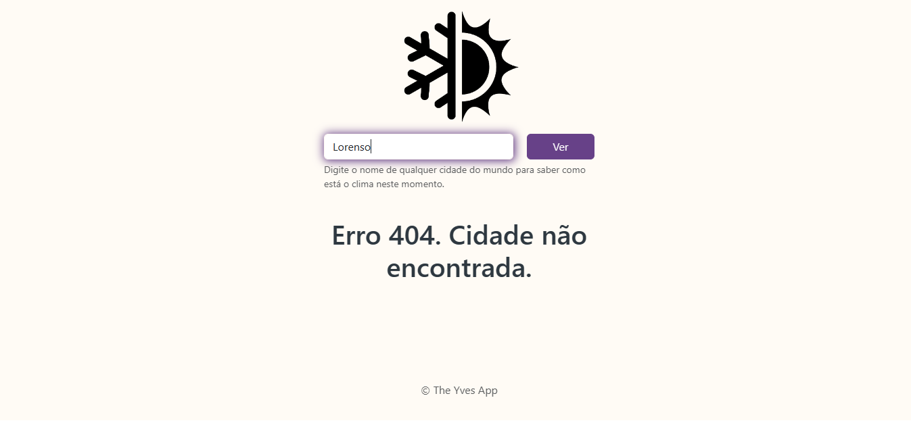

<h1 align="center"> Clima Aqui </h1>

  

 Projeto desenvolvido com NodeJS, Express, Bootstrap, CSS e HTML.
 

  <a href="#-sobre-o-projeto">Sobre o projeto</a>&nbsp;&nbsp;&nbsp;|&nbsp;&nbsp;&nbsp; 
  <a href="#-layouts">Layouts</a>&nbsp;&nbsp;&nbsp;|&nbsp;&nbsp;&nbsp;
  <a href="#-requisitos-e-recomendações">Requisitos e recomendações</a>&nbsp;&nbsp;&nbsp;&nbsp;&nbsp;&nbsp;

</img>

# 💻 Sobre o projeto 

Página web que, por meio do uso de uma API de clima, permite visualizar o clima de qualquer cidade no mundo em tempo real. O objetivo do projeto é aplicar conhecimentos sobre async await, servidor nodejs com express e consumo de API's utilizando a biblioteca HTTPS. 

  

# 📸 Layouts 

<h3 align="center">Tela do sistema com exemplo de busca bem sucedida</h3>

</img>

 
<h3 align="center">Tela do sistema com exemplo de erro na busca e o código do mesmo</h3>

</img>
 

  

# 📝 Requisitos e recomendações

REQUISITOS:
- node instalado
- npm instalado

PASSO-A-PASSO:
1- Executar os seguintes comandos dentro da pasta do projeto no terminal:
    - npm init
    - npm install express
    - npm install body-parser
    - npm install https
    - npm install dotenv
2- Para iniciar o projeto: npm app.js ou nodemon app.js (caso tenha instalado)

OBSERVAÇÕES: 
- O sistema foi rodado apenas localmente. O caminho PORT do .env.example diz respeito à porta local do sistema local escolhido. Já o caminho APPID_OPENWEATHERMAP diz respeito à chave única gerada pela API openweathermap para acesso aos seus servidores. 

  

# ✒️ Autor

Yves Lima Silva

<a href="https://www.linkedin.com/in/yves-lima-b63b2515b/"> Linkedin </a>
